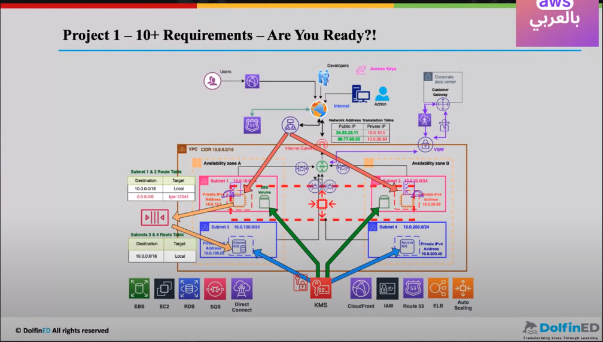
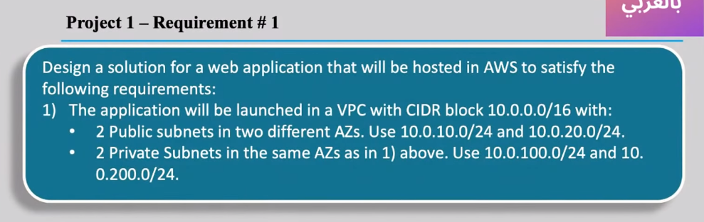
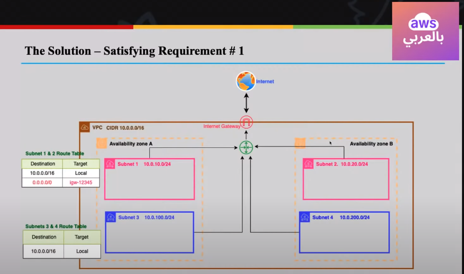
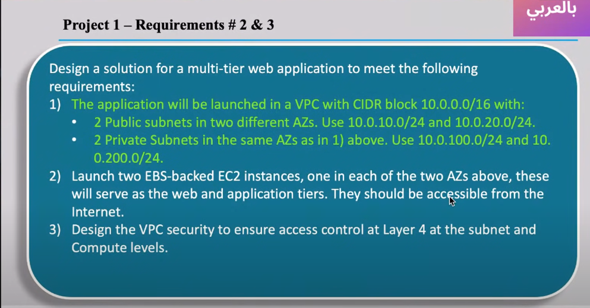
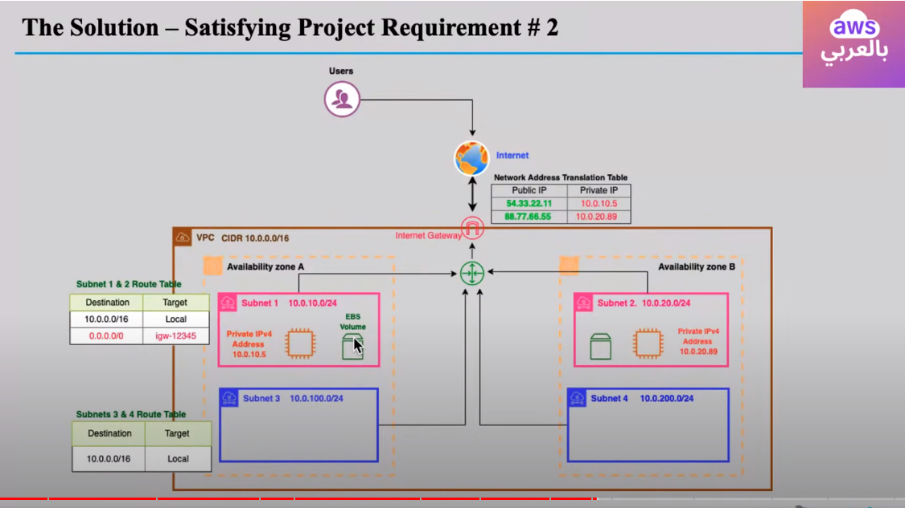

# aws_arab
this project based on the AWS bel3raby course
https://www.youtube.com/watch?v=Jm9aXmQaq-U&list=PLOoZRfEtk6kWSM_l9xMjDh-_MJXl03-pf&index=2 

below screenshot describe the full project.

and below will be the first assignment.

you can change the variable in terraform.tfvars based on your configuration

  env_tag = "aws_arab" 
  env_region = "us-east-1"
  vpc_cidr_block = "10.0.0.0/16"
  public_subnet_cidr_blocks_1a = "10.0.10.0/24"
  public_subnet_cidr_blocks_1b = "10.0.20.0/24"
  private_subnet_cidr_blocks_1a = "10.0.100.0/24"
  private_subnet_cidr_blocks_1b = "10.0.200.0/24"

  *************************************************************
  the second lecture assignment
  

  

you can change the variable in terraform.tfvars based on your configuration

  env_tag = "aws_arab" 
  env_region = "us-east-1"
  vpc_cidr_block = "10.0.0.0/16"
  public_subnet_cidr_blocks_1a = "10.0.10.0/24"
  public_subnet_cidr_blocks_1b = "10.0.20.0/24"
  private_subnet_cidr_blocks_1a = "10.0.100.0/24"
  private_subnet_cidr_blocks_1b = "10.0.200.0/24"

  the output is the two ec2 instance IPs